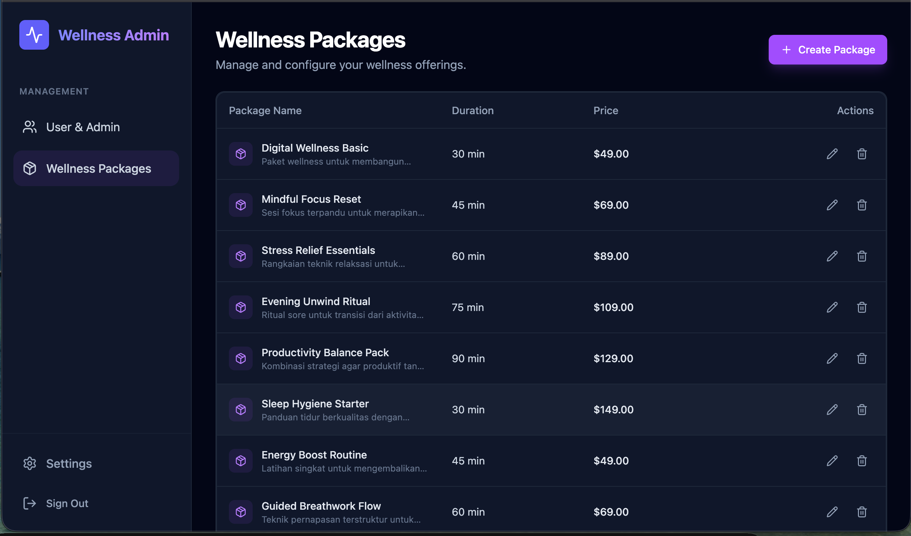
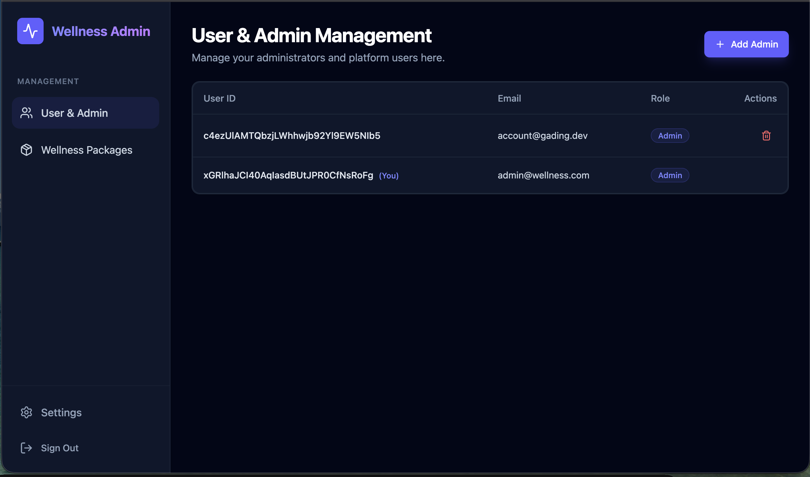
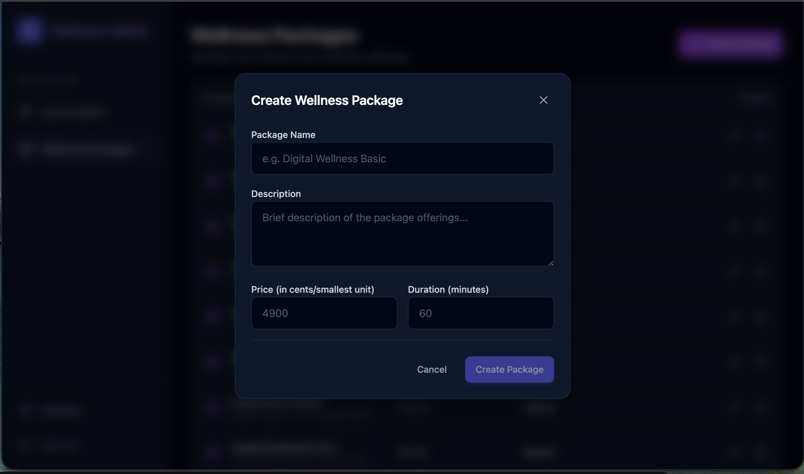
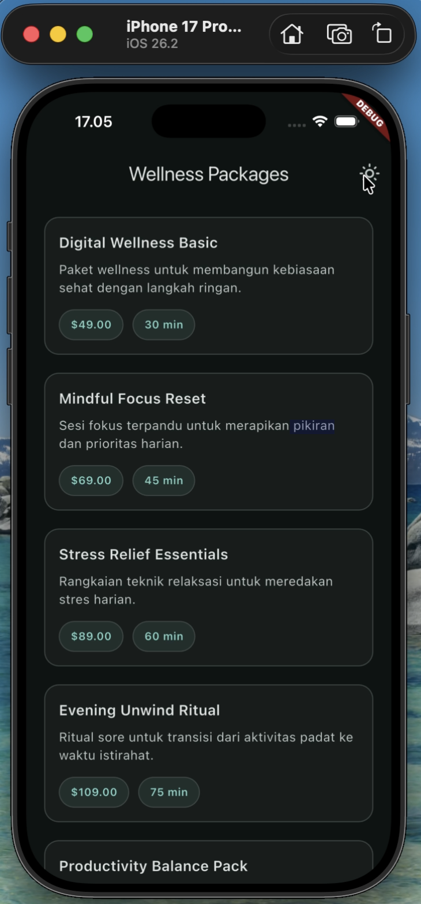

# Wellness Platform Monorepo

Welcome to the Wellness Platform. This repository is a full-stack monorepo containing backend services, admin dashboard, and mobile application for TUG Technical Test Purpose.

## 🏛️ Core Architecture

This project follows a **Modular Monorepo** pattern using **npm workspaces**. This approach ensures a clean separation of concerns while maintaining a unified development experience and shared type safety.

- **Apps Layer**: Contains independent applications (`backend`, `admin-portal`, `mobile-app`).
- **Packages Layer**: Contains shared code, most importantly `shared-typescript` which houses all Zod schemas.
- **Shared Contracts**: We use **Zod** as the single source of truth. Schemas defined in the shared package are used for backend validation and frontend type inference, ensuring the entire stack stays in sync.

## 🛠️ Technology Stack

| Component | Stack |
| :--- | :--- |
| **Backend** | NestJS, Drizzle ORM, PostgreSQL, Better Auth |
| **Admin Portal**| React, Vite, TanStack (Router, Query), Tailwind CSS |
| **Mobile App** | Flutter |
| **Shared** | Zod (Schemas & Types) |

## 🐳 Docker & Orchestration

The platform is fully containerized, providing a consistent environment from development to production.

- **Development**: Uses `docker-compose.dev.yml` with host-volume mounting for **Hot-Reloading** without needing local Node.js dependencies.
- **Production**: Applications can be built as isolated, lightweight images using dedicated build scripts (`build-docker-image.sh`) that create a minimal build context.

---

## 📚 Documentation Hub

We have organized our documentation into focused modules to help you get started quickly:

- 🏗️ **[Project Structure](docs/STRUCTURE.md)**: Overview of the monorepo layout and components.
- ⚙️ **[Setup Instructions](docs/SETUP.md)**: How to get the project running locally and with Docker.
- 🏛️ **[Architectural Decisions](docs/ARCHITECTURE.md)**: Our technology stack and design patterns.
- 🔌 **[API Design](docs/API.md)**: Standardized response formats and authentication details.
- 🧠 **[Assumptions Made](docs/ASSUMPTIONS.md)**: Decisions made during development.
- 🐳 **[Docker Guide](docs/DOCKER.md)**: Deep dive into containerization and deployment.
- 🔐 **[Auth & Guards](docs/AUTH.md)**: Details on security and identity management.

## 🚀 Quick Start

If you're already familiar with the stack, here's the "cheat sheet":

```bash
# 1. Install
npm install

# 2. Build Core
npm run build:shared

# 3. Development
npm run dev:backend   # API on port 9100
npm run dev:admin     # Admin UI on port 3001
```

For a more robust experience (including hot-reload without local Node dependencies), run:
```bash
npm run docker:dev
```

## 📸 Result & Screenshots

Here are some glimpses of the application:

### Admin Portal
<p align="center">
  
</p>
<br>
<p align="center">
  
</p>
<br>
<p align="center">
  
</p>

### Mobile App
<p align="center">
  
</p>
<p align="center">
  <a href="docs/screenshots/wellness-app.mp4">🎥 Click here to watch Mobile App Demo Video</a>
</p>
